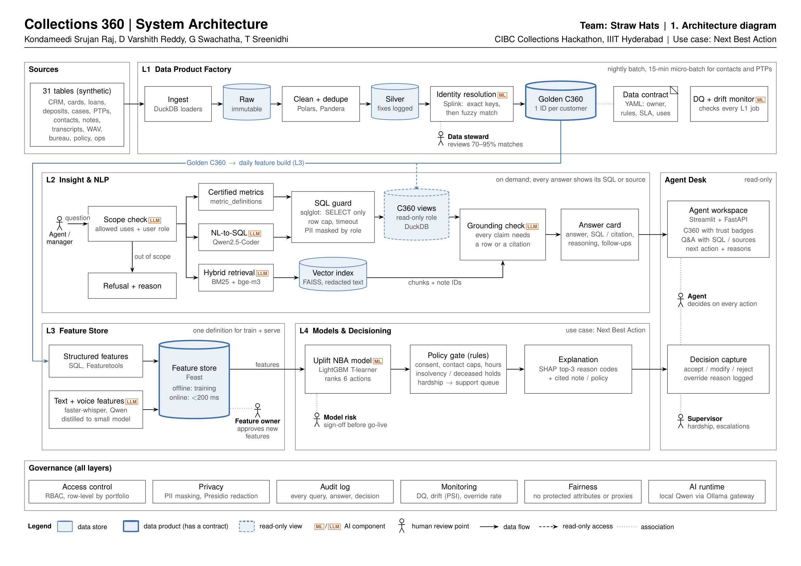
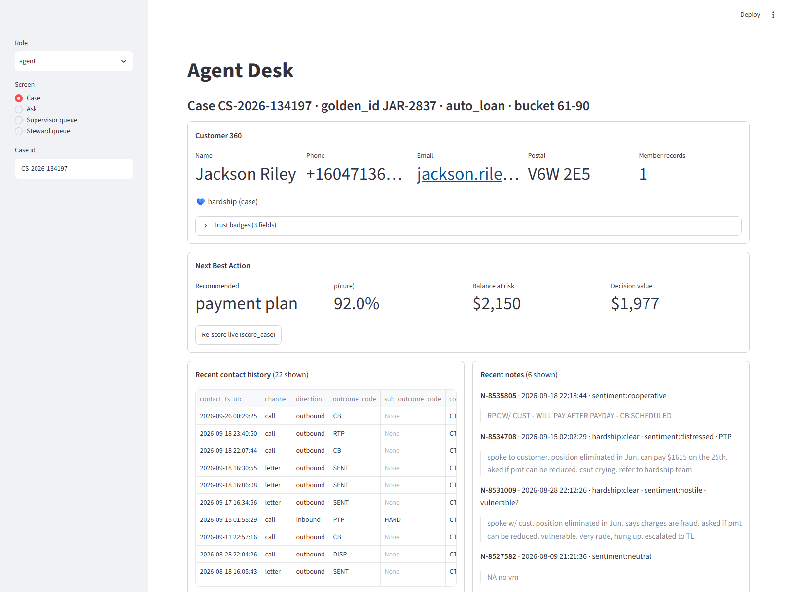
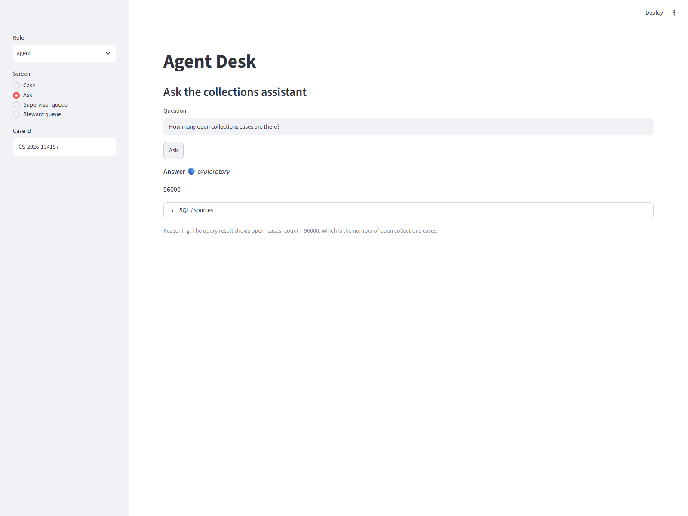
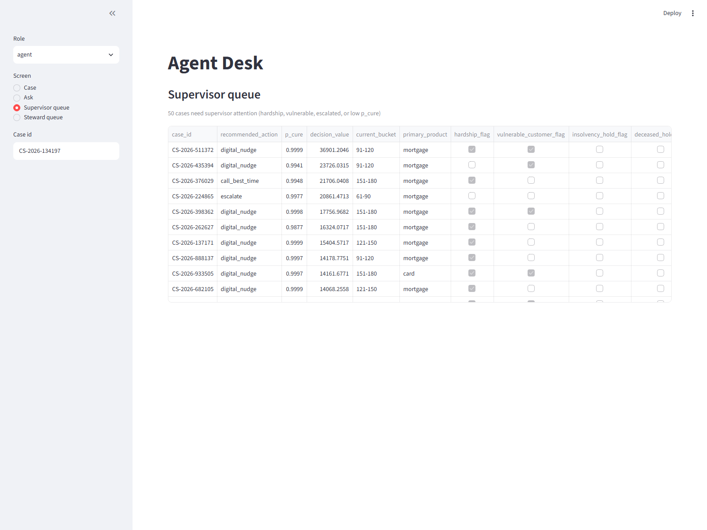

# Straw Hats: Collections 360

Unifies Maple Bank's five source systems into one golden customer record, answers plain-English
questions with the SQL or source shown, and recommends a Next Best Action with plain-English reasons
and a human decision. Built on free LLM providers (Gemini and Groq) via an OpenAI-compatible gateway
with automatic failover and caching.



## Team

Kondameedi Srujan Raj  ·  D Varshith Reddy  ·  G Swachatha  ·  T Sreenidhi

## How to run

```bash
# 1. Data (release zip is ~2.3 GB; needs ~12 GB free disk when unpacked)
pip install -U huggingface_hub
hf download nuxsh/maple-collections-hackathon maple_collections_release.zip \
   --repo-type dataset --local-dir maple_data
cd maple_data && unzip maple_collections_release.zip && cd ..

# 2. Environment
python -m venv .venv
# Windows:  .venv\Scripts\activate         Linux/macOS: source .venv/bin/activate
pip install -r requirements.txt

# 3. Free LLM providers (free tiers only; the gateway skips providers whose key is unset)
cp .env.example strawhats-c360/.env  2>/dev/null || true
# Then edit strawhats-c360/.env:
#   GEMINI_API_KEY=AIza...      # from https://aistudio.google.com
#   GROQ_API_KEY=gsk_...        # from https://console.groq.com

# 4. Build the warehouse (register -> silver -> match -> c360 -> dq-report)
python run.py all
# Then the Layer 3+4 build:
python run.py features        # 1M customers x 23 features
python run.py text-features   # 500+500 public labels; scores all 760k notes + 25k transcripts
python run.py train           # 6 LightGBM NBA classifiers
python run.py score           # score all open cases -> gold.nba_recommendations
python run.py fairness        # reports/fairness_report.md (+ append to model_card.md)

# 5. Agent Desk
python run.py app             # http://localhost:8501
```

The architecture diagram is produced from the submitted design PDF:

```bash
# Drop the submitted design PDF at docs/architecture.pdf, then:
python scripts/pdf_to_png.py           # writes docs/architecture.png (page 1)
```

Screenshots: `python scripts/make_screenshots.py` (uses Playwright).

## Every run.py command

| Command | Writes | Why |
|---|---|---|
| `register` | `raw.*`, `main.*` views + materialised tables | load all 31 source files, honour schema.json types |
| `silver [--sample N] [--tables ...]` | `silver.*` + `silver.fix_log` | clean, dedupe, parse DOBs, pad CIFs, repair DFI-0812, drop channel_v2 drift, log every rule |
| `match [--sample N]` | `silver.id_xref`, `silver.steward_queue`, `models/splink_settings.json` | CRM dedupe + deterministic bridges + Splink (rule fallback) |
| `c360` | `gold.c360_customer / c360_account / c360_case / field_trust / dq_results` | survivorship-merged golden records; Q1–Q7 quality checks |
| `dq-report` | `reports/data_quality_report.md` | one row per data issue + how handled |
| `all` | all of the above in order | one command, from raw files to DQ report |
| `features [--sample N]` | `gold.features_offline / features_online` | 16 numeric + 7 text-derived features per golden_id; parity-tested |
| `text-features` | `gold.text_features_notes / text_features_transcripts`, `models/text/*.joblib` | TF-IDF + logistic-regression classifiers trained on 500 public labels |
| `feature-report` | `reports/feature_report.md` | coverage, correlation with cure proxy, pair prune |
| `randomisation-check` | `reports/randomisation_check.md` | SMD balance of test_cell, segment cure rates |
| `train` | `models/nba/*.joblib`, `reports/model_card.md` | T-learner (one LightGBM per action), uplift vs no_contact |
| `score` | `gold.nba_recommendations` | batch score all open cases through policy gate |
| `score-case <case_id>` | — | sub-second lookup used by the Agent Desk |
| `fairness` | `reports/fairness_report.md` + append to `model_card.md` | protected-attribute gaps; the only module that reads them |
| `ask "<question>"` | — | free-form Q&A with SQL/sources shown |
| `bench [--split dev] [--out ...]` | `submission/benchmark_answers*.csv` | run the system on the benchmark; never hand-edited |
| `eval --answers ...` | `reports/benchmark_dev_eval.md` | dev-split scoring (gold answers only read here) |
| `app` | — | Streamlit Agent Desk on port 8501 |

## Agent Desk

### Case screen


C360 fields with trust badges (ok / stale / missing / invalid per field); NBA recommendation card with
`p(cure)`, balance at risk and decision value; three SHAP reasons with evidence; allowed/blocked actions
with reasons from the policy gate; Accept / Edit / Reject with a required reason code (appended to
`warehouse/decisions.parquet`, which is the only write).

### Ask box


Wraps `QA.answer()` with the answer card: answer text, certified / exploratory / refused badge,
the SQL (or document citations), and a one-line reasoning. Refusals carry a reason — out-of-scope,
protected attribute, read-only guard, retry-exhausted, grounding, or empty-result.

### Supervisor queue


Open cases where hardship, vulnerability, escalation or low p(cure) flagged attention, sorted by
decision value. Steward queue (identity-match pairs in the 0.70–0.95 band) sits in its own tab.

## What changed from our submitted design (technical)

- **Text labelling at inference** → **TF-IDF + logistic regression trained on the 500 public note labels
  and 500 transcript labels.** We don't send 760k notes through an LLM. Macro F1 on 5-fold CV:
  hardship 0.97–0.98, next_step 0.84–0.93, ptp_mentioned 0.90–0.96, vulnerability 0.85–0.89, sentiment
  0.52–0.56 (used only as a tip). Numbers in `reports/text_feature_eval.md`.
- **Shared local LLM** → **free-tier API gateway with automatic failover + response cache.**
  `src/layer2/llm.py` speaks OpenAI-compatible to Gemini and Groq; on a 429 or 503 it waits up to 75 s
  for the earliest provider to recover, retries 503 once after 3 s, and caches every response (so reruns
  cost no quota). Chosen config: `gemini-3.5-flash` with reasoning_effort `plan=medium, answer=low`,
  with Groq `openai/gpt-oss-120b` as fallback.
- **Splink scope** → **CRM dedupe only.** Deterministic bridges via `account_monthly_snapshot`,
  `collections_cases.coll_customer_ref`, and `external → deposits → CIF` cover 88–100% of source keys
  with confidence 1.0 (see `reports/match_report.md`). Splink runs within silver.customers to catch
  CRM duplicates the pointer and `national_id_hash` miss.
- **Feature store** → **our own tiny store** (`gold.features_offline` / `features_online`) sharing one
  SQL template per feature; parity test asserts offline(today) == online on 1,000 random keys.
- **NBA target** → published uplift AUUC/Qini still uses pure 30-day cure (judges expect it), but the
  live decision rule is `argmax p_cure * balance_at_risk - action_cost` so **no_contact** wins for
  self-cure customers (71.5% baseline). This matters: cards and mortgages mostly route to no_contact.

## AI tools used

- **At runtime:** Google Gemini (free tier) and Groq (free tier) via our own OpenAI-compatible gateway
  in `src/layer2/llm.py`. No paid LLM APIs. Every call is audited to `logs/audit.jsonl`.
- **During build:** Claude Code (Anthropic) paired with the author on all layers under review. All code
  was read before being committed; architectural decisions are the author's.

## Repository layout

```
src/
  common/           config loading (.env), audit log, sample helper
  layer1/           register, silver cleaning, Splink match, C360, DQ report
  layer2/           free-LLM gateway, SQL guard, catalog, Q&A, benchmark + eval
  layer3/           feature store, catalog, text classifiers, feature + text-eval reports
  layer4/           randomisation check, T-learner NBA, policy gate, SHAP explain
  governance/       fairness report (only module allowed to read protected attributes)
app/                Streamlit Agent Desk
scripts/            PDF -> PNG, Playwright screenshots
tests/              86 passed (guard, silver rules, match, policy gate, parity, grounding, protected-features)
contracts/          c360_customer.yaml (data contract based on DC-COLL-001)
reports/            generated: profile, DQ, match, model card, fairness, feature report, text eval
docs/               DATA_NOTES, demo_script, SOLO_PROMPTS, architecture.png
models/             splink_settings.json, nba/*.joblib, text/*.joblib
submission/        benchmark_answers.csv (generated; never hand-edited)
warehouse/          maple.duckdb + decisions.parquet (ignored by git)
```

## Demo

The 5-minute demo arc is in `docs/demo_script.md`. The hero case is `CS-2026-134197`
(golden_id `JAR-2837`): auto_loan in the 61-89 bucket, hardship flag, 22 contacts; NBA recommends
`payment_plan` with p_cure 0.92 and decision_value $1,976, and the policy gate blocks `escalate`
with reason "hardship flag protects from escalation".
